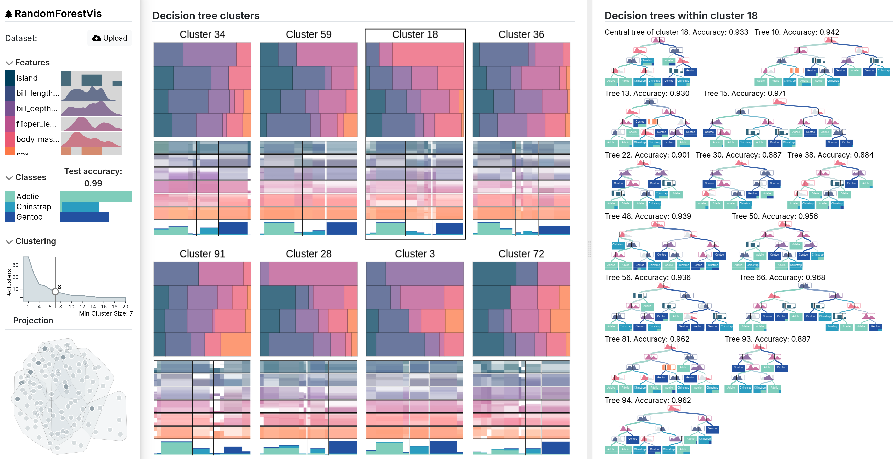

# RandomForestVis

This repository contains the code for the Random Forest visual analytics system of the VIS 2025 full paper 
"Cluster-Based Random Forest Visualization and Interpretation" by Max Sondag, Christofer Meinecke, Dennis Collaris, Tatiana von Landesberger, and Stef van den Elzen. The arXiv version is available at https://arxiv.org/abs/2507.22665




# Windows installation##
Install Git Bash: https://git-scm.com/downloads
Install Python (Tested with 3.12.8), make sure to specify the versions in the command if you are using multiple python versions)  https://www.python.org/downloads/release/python-3128/
-Add Python to environment variables
-Tick py launcher
Install Node.js (Tested with v22.17.1) https://nodejs.org/en/download
-Tick Automatically install the necessary tools (Required for C++ from sci-kit)
Install Microsoft Build Tools for Visual Studio https://visualstudio.microsoft.com/visual-cpp-build-tools/
-Tick Desktop development with C++
-Tick Node.js build tools


## Backend Dependencies
(Windows: Do this in Git Bash)

Create a virtual environemnt with: 
```
py -3.12 -m venv random-forest-backend
```

Activation: 
```
source random-forest-backend/bin/activate
Windows: source random-forest-backend/Scripts/activate
```

Install with: 
```
pip install -r backend/requirements.txt
```

You can probably use newer versions of python and the libraries but the evaluation was conducted with python 3.12.8 and the versions given in the ```backend/requirements.txt```. This is mostly important because of loading scikit-learn models between major versions.

## Development environment 

First install the package dependencies with:

```
$ npm install
```

Build with:

```
$ npm run build
```

And run a development server with:
```
$ cd backend/
$ py -3.12 fastapi-rf.py
```

Leave it running, and start a new git-bash terminal in the root folder and run:
```
$ npm run serve
```

Use the browser to go to http://localhost:8080/ . You should now see the figure at the top of the readme, which correspond to Fig.1 from the paper.


## Upload Data
Accepted are csv files with ",", ";", "|", or "\t" as delimiter. The target class needs to be the last column.

